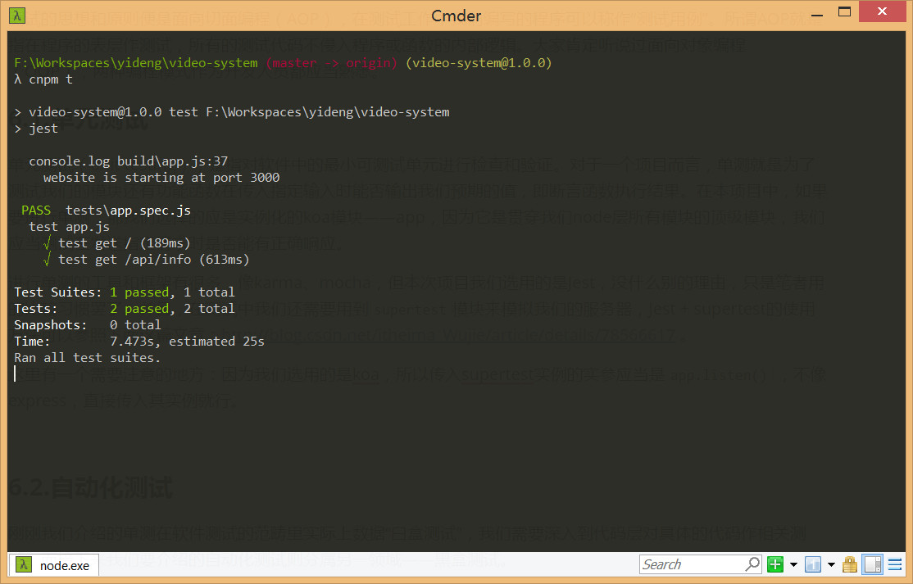

# 三天打造一款全栈简易视频直播网站（二）

------

——从前端谈项目架构、接口设计、前后端设计、node.js中间层封装、项目测试、性能优化以及运维部属


## 0.今日任务

昨天我们已经完成了网站的Views层的工作，也能够用webpack打包生成我们的上线文件，那么今天我们要做的，便是完善我们的Controller层和Model层，直白点，就是封装我们的node.js接口，为我们的页面提供渲染数据。今天我们涉及的知识会比昨天多得多，包括了大量的后端思想，所以前方高能，大家做好准备。

今天的任务，我们大体可以分为以下部分：开发机node环境搭建、接口设计、开发机模拟服务器搭建、koa2搭建node服务器、gulp打包、项目测试（单元测试、模块化测试、UI测试）。其实昨天我们已经写好了PHP接口层的代码，还有我们的SQL语句，今天我们要做的，就是把他们部署到我们开发机上搭建的模拟服务器上，并且今天，我会给大家引入两款如今开发经常使用的服务器软件——xampp和wamp。

事先说明下，因为TDD和BDD都是敏捷开发的思想（不知道是啥？Google去），但因为TDD模式笔者实在hold不住，所以今天的工程我们将以BDD的模式进行开发。

完整的项目我已经托管在了github上，欢迎大家提出批评和意见，地址是：https://github.com/jerryOnlyZRJ/video-system

## 1.开发机node环境搭建

今天我们要封装node中间层，有很多人会有疑问，我们为什么要加一层node ?直接拉后端PHP层的数据不就可以了？网上也有很多舆论，居然还有人说node就是个玩具，不能用于项目，一个单进程的玩意一崩网站全崩。对于前者，你们的问题我稍候就会回答，而对于那些思想还停留在“node做不了什么事情”的人，我只会奉上一句话：“大佬出门左拐，不送！”

### 1.1.node多进程

那么，我们为什么要用node来作为我们的中间层？首先我们得知道node的优劣，这里分享一份链接，找了挺久写的还算详细：https://www.zhihu.com/question/19653241/answer/15993549 。其实都是老套路，那些说node不行的都是指着node是单进程这一个软肋开撕，告诉你，我们有解决方案了——pm2。这是它的官网：http://pm2.keymetrics.io/ 。它是一款node.js进程管理器，具体的功能，就是能在你的计算机里的每一个内核都启动一个node.js服务，也就是说如果你的电脑或者服务器是多核处理器（现在也少见单核了吧），它就能启动多个node.js服务，并且它能够自动控制负载均衡，会自动将用户的请求分发至压力小的服务进程上处理。听起来这东西简直就是神器啊！而且它的功能远远不止这些，这里我就不作过多介绍了，大家知道我们在上线的时候需要用到它就行了，安装的方法也很简单，直接用npm下到全局就可以了`$ npm i pm2 -g`具体的使用方法还有相关特性可以参照官网。这里我在`build`文件夹内添加了`pm2.json`文件，这是pm2的启动配置文件，我们可以自行配置相关参数，具体可参考github源码，运行时我们只要在上线目录下输入命令`$ pm2 start pm2.json`即可。

### 1.2.前端必须会使用node

看完我这个标题，肯定有人会说，凭什么就必须啦？我一个前端会切切图写写界面照样能有工作，我干嘛要去接触这些“后端”的东西。如果你的职业生涯只局限于“传统前端”，那我无言以对，不过现在是“大前端时代”，node是一名前端工程时的必备素养，为什么这么说，请听我细细道来：


#### 1.2.1.前后解耦

现在的开发流程都注重前后端分离，也就是软件工程中常提到的“高内聚低耦合”的思想，你也可以用模块化的思想去理解，前后解耦就相当与把一个项目分成了前端和后端两个大模块，中间通过接口联系起来，分别进行开发。这样做有什么好处？我就举最有实际效果的一点：“异步编程”。这是我自己想的名字，因为我觉得前后解耦的形式很像我们JS中的异步队列，传统的开发模式是“同步”的，前端需要等后端封装好接口，知道了能拿什么数据，再去开发，时间短，工程大。而解耦之后，我们只需要提前约定好接口，前后两端就可以同时开发，不仅高效而且省时。

#### 1.2.2.异步IO

我们都知道node的核心是事件驱动，通过loop去异步处理用户请求，相比于传统的后端服务，它们都是将用户的每个请求分配一个进程进行处理，推荐大家去看这样一篇博文：https://mp.weixin.qq.com/s?__biz=MzAxOTc0NzExNg==&mid=2665513044&idx=1&sn=9b8526e9d641b970ee5ddac02dae3c57&scene=21#wechat_redirect 。特别生动地讲解了事件驱动的运行机制，通俗易懂。事件驱动的最大优势是什么？就是在高并发IO时，不会造成堵塞，对于直播类网站，这点是至关重要的，我们有成功的先例——快手，快手强大的IO高并发究其本质一定能追溯到node。

#### 1.2.3.掌握路由

网络路由是什么？可不是你身边的那个路由器啊。在网络技术这一大课题中，“路由”是这样定义的：路由是指路由器从一个接口上收到数据包，根据数据包的目的地址进行定向并转发到另一个接口的过程，简单的说，路由就是决定数据走向的过程。在网络项目中，路由往往与接口紧密联系，我们通过接口实现路由。而在传统的开发中，接口都是后端写好的，谁掌握了接口谁就掌握了路由，现在时代不一样了，身为前端的我们，也能掌握路由。如果说路由的实际意义是什么，我会说，如果一个项目是一艘远航的船，那么路由就是船头的舵。

### 1.3.疑问：封装node层是否会增长用户请求链？

有人会说，加层node不就增加了用户请求链的长度了吗，用户得先发请求到我们的node服务器上，再由node转发到我们的PHP后端机上，那跟用户直接发请求到后端机上比起来延时肯定会增加啊？这边我得和大家仔细讲讲，在研究这个问题之前，大家得先明白数据在广域网和局域网中的传输速率是有数量级的差别，因为在广域网中，数据传输必须要走网络层，而在局域网中，数据的传输大多情况下走的都是数据链路层（相关知识请参考《计算机网络技术》）。而众所周知，你项目的服务器肯定是得部署在公司的服务器上吧，你总不能把node装自己家里吧，  那么，用户无论是请求我们的node还是PHP后端机，走的都是广域网，时间相同，而node请求PHP后端机，走的是局域网，时间基本可以忽略不计，也就是说，我们搭建了node层并不会增长用户的请求链，所产生的延迟更可以忽略不计。


说了这么多，最最重要的是，你个前端工程师一辈子都只会在那写写样式绑绑事件，你死不死。我们就应该有更高的精神追求，可以这么说，在项目中你如果能拿下node，那你基本拿下了项目的半边天。

## 2.接口设计

### 2.1.了解RESTful

接口是连接前端和后端的桥梁，在前后分离的开发模式中，紧密联系着前后端工作的便是那份至高无尚的“接口文档”。因为前端需要知道，我们能拿到什么，而后端需要知道，他们该输出什么。而设计并分配接口的过程，我们可以称为路由。在网站项目中，无论是前端还是后端，谁掌握了路由的制定权，谁就基本掌握了项目的主动权，这些我在1.2里面已经提及到了，因为浏览器是通过路由决定展示的数据，也就是说，用户在地址栏输入什么，浏览器会输出什么，都是路由的制定者说的算。

那么接口的制定总得有个标准吧，就像我们的语言，有语言的标准（ECMAScript），这时候我们就必须提到RESTful，REST并不是rest（休息）的意思，这里就不必深究了，我们只需要记住它是一套标准就行了，如果你想深入了解，可以看看这篇文档：http://www.ruanyifeng.com/blog/2011/09/restful 。说白了，RESTful的实际意义就是通过HTTP method来区分用户操作的性质，用户如果要从后台拉取数据，发送请求时应当使用GET方法，同理，添加数据用POST，删除数据用DELETE，更新数据用UPDATE。这是一套很好的思想，值得我们去借鉴，但是在实战开发的大多数时候，我们都仅使用GET和POST方法去实现用户的所有操作，真正的功能划分已经被我们细化到了URL也就是路由里了。

### 2.2.定义规则

了解了RESTful之后，我们开始对我们的项目制定接口规则，这里，我们统一使用GET方法来拉取数据，使用POST来进行其他操作。对于路由分配，我们使用`/controller/action`原则，`controller`表示接口的功能模块，`action`表示接口的具体操作，例：`/user/login`，这就表示一个user模块的登录接口。

## 3.开发机模拟服务器搭建

这里，我们需要搭建一台模拟服务器作为我们调试接口的数据来源，这里我们可以使用wamp或者xampp，wamp是应用于windows系统下的服务器软件，这里我更推荐xampp，这是一款即可以用于windows系统下也可以Linux系统下的服务器软件。众所周知，市面大多数服务器系统都是Linux，而且学会Shell操作也会是前端工作的一项加分点，关于这方面内容，我们会在第三天的“上线服务器”环境搭建里更为详细的介绍，今天大家只要能够在开发机上安装好服务器软件并将我们之前编写好的info.php文件复制到服务器主目录下即可（wamp的服务器主目录是根目录下的`www`目录，xampp的主目录是根目录下的`htdocs`目录）。

接下来，打开服务器自带的mysql服务（wamp在菜单栏中点击phpMyAdmin，xampp则需要在浏览器打开`http://localhost/`并在顶部导航栏点击phpMyAdmin），执行我们之前写好的`info.sql`里的SQL语句，这样，我们就在Mysql系统里创建了一个名为`video`的数据库，下面有存放着我们所需信息的名为`info`的数据表。

接下来，大家试着去访问`http://localhost/info.php`，就可以看到我们的输出信息啦。

## 4.koa2搭建node层

终于轮到了我们的主角上场了——koa2，koa是由express团队打造的新框架，用过express其实很容易上手，但我们今天并不是作koa2教程，因此对具体代码不作讲解，读者可自行参考源码，这里只会提及几项侧重点。

### 4.1.完备开发目录

在编写代码之前，我们需要先在`src`目录下新增几项目录和文件作为我们接下来工作的准备，增加后的项目目录如下：（文件命名规则同第一天，以`.es`后缀区分ES6文件）

```
├── config  静态配置
├── models	数据拉取
├── public
├── routers  路由相关
├── views
└── app.es  服务器启动文件
```

`config`模块用于存放我们的配置信息，包括node请求后台的URL，高频率使用的可缓存数据；`models`模块用于实现我们的数据拉取，并导出相关方法；`routers`模块利用我们之前商定的接口规则，实例化API；`app.es`是服务器启动文件，存放中间件并导出`app`koa实例，供将来测试使用。

### 4.2.特别注意

因为之前我们在PHP中使用了`json_encode()`，将我们的对象数组转化成了字符串的形式在网络链路中传输，这样做的好处可以增加数据的安全性，防止被恶意注入，在封装node层的时候，有的人可能图方便会直接`JSON.parse()`将他转化为对象数组，这么做是不合适的，因为我们之前提到，用户访问node的时候还是通过广域网，因此还有被恶意注入的可能。

还有一个地方需要特别说明，大多数时候我都会用模版，像用`koa-swig` 直接render HTML页面并返回，这也是SSR（Server Side Render）模式的传统套路。但由于本项目比较简单，我就打算在用户get网站根目录时直接返回我们之前编译好的`index.html`文件。这时候问题来了，koa并不像express有读文件（sendFile）的API，为了解决这一问题，我使用了node自带的fs模块来读文件：

```javascript
router.get('/',async (ctx, next) => {
  ctx.type = 'html';
  ctx.body = await fs.createReadStream(CONFIG.get('indexPath'));
});
```

这样就能返回我们所期望的`index.html`界面啦。

## 5.Gulp打包node层文件

到了这一步时我们今天的工作基本快完成了，不过之前提到过，我们编写源代码时使用的都是ES6语法，这些代码是需要被编译之后才能在node中执行的，这时候问题来了，难道我们需要打开每一个文件夹一次次去Babel吗？有没有什么办法可以实现自动化编译？懒人福音：答案是有的，Gulp善良登场。

Gulp同Grunt还有Webpack一样，是一款自动化打包工具，但是他和另外两者又有什么区别呢？为什么我们要使用Gulp作为node层的打包工具？


就我而言，我是以开发过程中的MVC思想来区别不同的打包工具，前端HTML组件实现、前端JS业务逻辑实现、前端CSS样式实现这些工作可以视为我们的Views层工作，node.js部分可以视为我们的Controller和Model层的工作。webpack之所以更适合作Views层的打包工具，因为它可以把我们引用的模块都打包进同一个JS文件中，而且还能自动给html模版添加`script`引入，解决了浏览器不支持JS模块化（浏览器不支持`require`,`import`,`export`）的问题，让我们在编写前端JS代码时也能以模块化的思路进行，相比于其他框架和插件，我们只需要写一份配置文档，其他都是自动化执行，而且它也对React和VUE的支持效果很好，所以更适合我们在做前端开发的工作中的使用和对资源的压缩。

再说M&C层的工作，我们经常会使用新的标准(ES678)去编写我们的代码，诸如`import`或者`export`这些新增的关键字，但是这些语法糖在node.js中也是无法执行的，所以我们需要进行Babel编译，通过使用Gulp或者Grunt这类打包工具就可以快速实现我们的babel编译以及其他功能，还能实时监听文件内容变化自动编译，但在开发过程中我们往往不希望将node.js层的代码都打包进一个文件中去，因为在配合后端的接口时我们往往还需要调配路由，层次明朗的项目目录能够给予我们更高的可维护性。并且，如果没有刻意配置，他们不会将依赖中的代码注入编译后的文件中，因为node.js不像浏览器本身就支持模块引入，模块代码注入是没必要的，所以更适合用于M&C层的代码的打包工作。Gulp和Grunt的功能基本相同，原理也类似，只不过一个是流式打包工具而另一个是配置型打包工具，Grunt和Webpack类似，会写配置就好，而Gulp更多的是以编程的思想让我们去编译一份文件，这可以根据个人喜好自行选择。因为之前用了webpack，所以这次我们选择gulp。

在Github市场上，新的打包工具层出不穷，我们应该怀着包容的心态敢于尝试而不是抵触他们，要取其精华去其糟粕，谁能说的准其中会不会有一种就是未来，每种打包工具能够产生并得到大众的熟知，肯定有自身的闪光点。

要使用Gulp编译我们的文件，只需要在项目根目录下新建一个`gulpfile.js`文件并在里面编写相关打包操作，具体操作可以参考官网及项目源代码。

## 6.项目测试

使用gulp打包好文件之后，试着执行一下`$ node build/app.js`,在浏览器输入`http://localhost:3000`,看看效果吧，接下就该进入有趣的测试环节了。就前端而言，我们可以上手的测试工作有：单元测试、UI测试、自动化测试。因为大家也知道UI界面都是我自己设计的，也没有什么设计图纸，所以UI测试这部分本项目就不做研究了，如果大家有兴趣可以看看BackstopJS这款插件（传送门：https://garris.github.io/BackstopJS/）。

接下来该进入我们的测试正题了：

测试的思想和原则便是面向切面编程（AOP），在测试工作中我们编写的程序可以称作“测试用例”。所谓AOP就是指在程序的表层作测试，所有的测试代码不侵入程序或函数的内部逻辑。大家肯定听说过面向对象编程（OOP），两种编程模式作为开发人员都应当熟悉。

### 6.1.单元测试

单元测试（unit testing），是指对软件中的最小可测试单元进行检查和验证。对于一个项目而言，单测就是为了测试我们的模块还有功能函数在传入指定输入时能否输出我们预期的值，即断言函数执行结果。在本项目中，如果要进行单测，那我们选择的应是实例化的koa模块——app，因为它是贯穿我们node层所有模块的顶级模块，我们应当测试在发送指定请求时是否能有正确响应。

进行单测的工具和框架有很多，像karma、mocha，但本次项目我们选用的是Jest，没什么别的理由，只是笔者用的比较习惯罢了。并且，在测试中我们还需要用到`supertest`模块来模拟我们的服务器，Jest + supertest的使用方法可以参照下面这篇文章：http://blog.csdn.net/itheima_Wujie/article/details/78566617 。

这里有一个需要注意的地方：因为我们选用的是koa，所以传入supertest实例的实参应当是`app.listen()` ，不像express，直接传入其实例就行。



###6.2.自动化测试

刚刚我们介绍的单测在软件测试的范畴里实际上数据“白盒测试”，我们需要深入到代码层对具体的代码作相关测试，而接下来我们要介绍的自动化测试则分属另一领域——黑盒测试。

大家对于黑盒测试的印象大多应该都停留在“拿着鼠标对着界面点点点就行了，如果能点出BUG再好不过”，我在浏览器写调试代码的时候常想，既然我们可以通过JS操作我们的网页，那么能不能用它来进行我们的黑盒测试？答案是肯定的，selenium-webdriver应运而生。具体用法大家可以参照npm官网上这款插件的使用说明：https://www.npmjs.com/package/selenium-webdriver 。需要使用到的API可以参照selenium官网的JS版块：https://seleniumhq.github.io/selenium/docs/api/javascript/module/selenium-webdriver/ ，具体代码实现可以参照本项目下的`tests/e2e.js`文件，最终的效果便是计算机能自动打开我们的Firefox，并在地址栏输入我们的网址，自动点击相关位置执行我们的指定操作，真正进行了实操之后你就会发现它的神奇之处啦。

PS：这里需要注意一下，选择drivers的时候尽量选用`geckodriver(.exe)`（Firefox的驱动程序），因为chrome的drivers我试过好多次不知道怎么回事总是用不了，其他计算机也有同样的情况，所以我建议大家最好下个火狐用于咱们的自动化测试，不单单是这样，以后作兼容浏览器的时候也能用到嘛。虽然说现在浏览器之间的兼容性已经很不错了，但是每个浏览器的特性还会产生一些隐匿的BUG，强如谷歌火狐也是如此，我前几个月就刚遇到过元素样式差异，写的同一个`：before` 伪元素在chrome和Firefox上竟然出现了两种不同的呈现，郁闷了好久，不过这不是本项目的话题，我就不去多说啦。

## 7.结语

第二天的任务到现在就基本完成啦，回顾一下我们两天的努力，我们已经搭建好了项目的node层，实现了页面的样式还有业务逻辑，在控制台执行`$ node build/app.js`并在浏览器的地址栏中输入`http://localhost:3000`就能看到我们的网站，其实到了这一步，如果仅仅是以前端工程师的角度出发，我们的项目任务已经大体完成了，剩下的任务就是将性能作进一步优化，还有将项目部署到我们的上线服务器上并且映射到公网上，但后者是运维的工作，不过作为前端进阶项目，明天我们会在这块内容作详细讲解。本项目的目的，就是让身为前端工程师的你能够独立完成项目的编程→测试→上线这一完整流程。


其实到今天，一定会有这样的质疑声：看了你两天的博文，我还是啥都不会啊，项目我只知道了要去做什么，而不知道该怎么做。的确，我编写这几篇博文的目的就是如此，我没有在文章中下一点手笔去讲项目的任何代码的编写过程，目的就是不让读者照着我的编码方式生搬代码，这样我教给大家的并不是知识，而是用我自己打造的“模型”去复制更多的“我”罢了，那样的方式是没价值没意义的。我在文章中引入的博文都是我在项目中多次用到的拓展知识，其他关于框架还有插件的使用方法都可以在官网上查到对应的入门文档，本项目真的很“简易”，用不到多深的API，在官网翻文档足够。所谓“师父领进门，修行在个人”，我已经帮你指明了方向，剩下的路，该你自己去趟。如果大家在项目中遇到了瓶颈，欢迎大家留言，我会尽快去帮忙解决的。今天的知识很多都很抽象，逻辑性很强，希望大家在完成项目后还能多去翻看自己编写的代码，多去理解咱们之前每一步工作的实际意义。

PS：如果大家在文章中发现了明显的错误，我希望您能第一时间反馈给我，欢迎致电我的邮箱：920997736@qq.com 。之所以把项目共享在github上，也希望能共同进步，作为一名初出茅庐还未毕业的前端爱好者，如果有失误纯属必然，望大家谅解，不喜勿喷。

最后照例来句每日箴言：Talk is cheap,show me your codes.